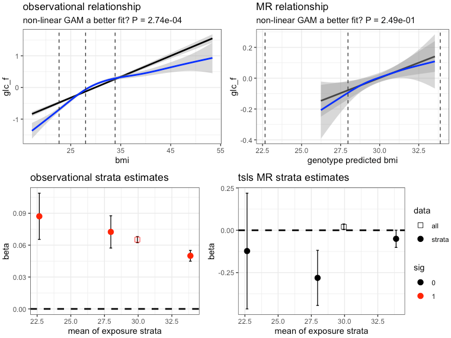

# glsmr

### GAM and linear stratified MR

This is an R package to aid in determining if observational or two-stage least square (instrument variable or in genetics Mendelian randomization) analysis have a non-linear relationship between expoosure and outcome. 

### installation

	devtools::install_github("hughesevoanth/glsmr")

### use
	
- There are two functions that are most useful
	- glsmr()
	- plot_glsmr()
	
- an example for using glsmr
       	
		myexample = glsmr( wdata = mydata,
	          outcome = "glucose",
	          exposure = "bmi",
	          instrument = "bmi_grs",
	          linear_covariates = c("batch", "sex"),
	          smooth_covariates =  c("age"),
	          # strata = 4, ## for quartiles
	          strata = c(17,25,30,62),
	          rnt_outcome = TRUE,
	          weights_variable = NA,
	          sd_outlier_cutoff = 5,
	          sd_or_iqr_cutoff = "iqr")
	

	- NOTE: 'smooth_covariates' will be modeled as smooths or non-linear variables in the GAM, but as typical parametric variables in the linear and tsls analyses. 
          
- an example for using plot_glsmr()
		
		plot_glsmr(myexample,
			add_strata_2_curves = FALSE,
			add_strata_2_points = TRUE,
			brewer_col = "Set1")

### An example figure from plot_glsmr()

### Brief description of glsmr steps

1. identify oucome outliers and turn into NA
2. identify exposure outliers and turn into NA
3. estimate Shapiro Wilk W-statistics for outcome
4. estimate Shapiro Wilk W-statistics for exposure
5. fit a standard lm() linear model to full data set
6. fit a null GAM to full data set, where the exposure is modeled as a parametric variable
7. fit a GAM to the full data set, where the exposure is modeled as a smooth variable
8. perform an F-test to determine if a non-linear exposure model is better than the linear null model (step 7 vs step 6)
9. stratify the data
10. run a standard observational linear model on each strata
11. run a TSLS (ivreg) on the full data set
12. estimate d.hat or the instrument predicted exposure
13. fit a null GAM to full data set, where d.hat is modeled as a parametric variable
14. fit a GAM to full data set, where d.hat is modeled as a smooth variable
15. perform an F-test to determine if a non-linear d.hat model is better than the linear null model (step 14 vs step 13)
16. run a tsls ivreg model on each strata

### objects returned by glsmr as a list

1. strata_linear_mods: a data frame of observational strata estimates
2. strata_ivreg_mods: a data frame of tsls strata estimates
3. summary_stats: a vector of summary statistics
	- n for outcome outliers
	- n for exposure outliers
	- W-stat for outcome
	- W-stat for exposure
	- was the outcome rank normal transformed
	- number of strata produced
	- p-value (F-test) for a non-linear observational model better than a linear model .. gam() vs gam()
	- an estimate of the variance explained (Rsq) by instrument on exposure
	- p-value (F-test) for a non-linear TSLS (d.hat) model better than a linear model .. gam() vs gam()
	- user defined exposure
	- user defined outcome
4. full_linear_model: lm() object, product of step 5
5. null_full_gam_model: gam() object, product of step 6
6. full_gam_model: gam() object, product of step 7
7. full_ivreg_model: ivreg() object, product of step 11
8. null_full_iv_gam_model: gam() object, product of step 13
9. full_iv_gam_model: gam() object, product of step 14
10. model_data: user defined data for models

### glsmr() parameters

1. wdata: a data frame holding all the necessary data for the analysis. Samples in rows, variables in columns
2. outcome: column name indicating the designated outcome
3. exposure: column name indicating the designated exposure
4. instrument: column name indicating the designated instrument (NOT d.hat | instrument predicted exposure)
5. linear_covariates: column name indicating the designated covariates that should always be considered parametric or linear.
6. smooth_covariates: column name indicating the designated covariates that should be modeled as non-linear smooths in the GAMs.
7. strata: a single numeric value to define the number of quantiles, or a numeric vector (>= length 3) of user defined boundries.
	- Example: strata = c(1,10,20,30) would give the following 3 strata
		- x >= 1 & x < 10 ; 1 to 10 including 1.
		- x >= 10 & x < 20 ; 10 to 20 including 10.
		- x >= 20 & x <= 30 ; 20 to 30 including 20 and 30.
8. rnt_outcome: should the outcome be rank normal transformed TRUE or FALSE?
9. weights_variable: column name indicating the designated weights variable. As of yet not fully integrated into package.
10. sd_outlier_cutoff: the number of SD or IQR units to use as a cutoff threshold. SD uses means, IQR uses medians.
11. sd_or_iqr_cutoff: the string "iqr" will use median and IQR unit distances, all other string values would use means and SD unit distances.

