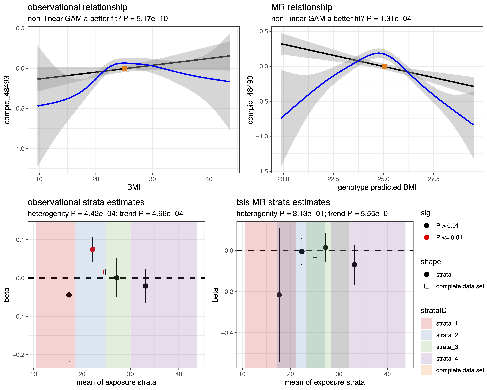

# glsmr

### GAM and linear stratified MR

This is an R package to aid in determining if observational or two-stage least square (instrument variable or in genetics Mendelian randomization) analysis have a non-linear relationship between expoosure and outcome. 

### installation

	devtools::install_github("hughesevoanth/glsmr")

### use
	
- There are two functions that are most useful
	- glsmr()
	- plot_glsmr()
	
- an example for using glsmr
       	
		myexample = glsmr( wdata = mydata,
	          outcome = "trait",
	          exposure = "bmi",
	          instrument = "bmi_grs",
	          linear_covariates = c("batch", "sex"),
	          smooth_covariates =  c("age"),
	          # strata = 4, ## for quartiles
	          strata = c(10,18.5,25,30,45),
	          rnt_outcome = TRUE,
	          weights_variable = NA,
	          outlier_method = "iqr",
	          outlier_cutoff = 5,
	          messages = FALSE,
	          return_models = TRUE)
	

	- NOTE: 'smooth_covariates' will be modeled as smooths or non-linear variables in the GAM, but as typical parametric variables in the linear and tsls analyses. 
          
- an example for using plot_glsmr()
		
		plot_glsmr(myexample,
			add_strata_2_curves = FALSE,
			add_strata_2_points = TRUE,
			brewer_col = "Set1",
			old_plot_scheme = TRUE,
			old_GAM_smooths = TRUE,
			plot_obs_res_betas = FALSE,
		  	pval_thresh = 0.05)

### An example figure from plot_glsmr()

### Brief description of glsmr steps

1. Setting up the data
	1. identify oucome outliers and turn into NA
	2. identify exposure outliers and turn into NA
	3. estimate Shapiro Wilk W-statistics for outcome
	4. estimate Shapiro Wilk W-statistics for exposure
	5. if requested rank normal transform the outcome
	6. derive the IV-free exposure with > residuals( lm(exposure ~ iv) ) + mean(exposure)
	7. derive instrument predicted exposure. Sometimes called d.hat.
	8. fit a no exposure GAM with defined parametric and smooth covariables to extract outcome residuals.
	9. stratify the data by the exposure for stratified observational analyses
	10. stratify the data by the iv-free-exposure for the stratified MR analyses 
2. Observational Modeling
	1. fit a NULL GAM with exposure modeled as a parametric term
	2. fit a full GAM with the exposure modeled as a smooth term
	3. test for non-linearity with a F-test
	4. test for non-lineariry with a Likelihood-Ratio test (LRT)
	5. fit a linear ( lm() ) model where all covariables are parametric terms and extract summary statsistics.
	6. fit a linear model to the exposure stratified data and extract summary statistics
	7. fit a univariable linear model to the stratified data but using the GAM residuals from step1.7 as the outcome and extract summary statistics.
	8. perform a meta analysis and a meta analysis with a modulator (mean of stratified exposures) term to results of 2.6 and 2.7.
3. MR Modeling
	1. fit a NULL IV GAM setting the IV-predicted-exposure from step 1.7 as a parametric term.
	2. fit a full IV GAM setting the IV-predicted-exposure from step 1.7 as a smooth term.
	3. test for non-linearity with a F-test.
	4. test for non-linearity with a Likelihood-Ratio test (LRT).
	5. estimate the (complete|full data) instrument on exposure effect (beta_ie)
	6. estimate the (complete|full data) instrument on outcome effect (beta_io)
	7. estiamte the (complete|full data) causal effect using the ratio method beta_iv = beta_io/beta_ie
	8. estimate the causal MR effect using ivreg Rpackage.
	9. estimate beta_ie on the iv-free-exposure stratified data 
		1. NOTE: the exposure remains the exposure, not the iv-free-exposure
	10. perfom a meta-analysis on the stratified beta-ie to test the IV-assumption (heterogeneity among strata) 
	11. estimate beta_io on the iv-free-exposure stratified data
	12. estimate beta_iv on the iv-free-exposure stratified data using the ratio method
		1. beta_ie (denominator) is set as the full data set estimate from step 3.4
		2. beta_ie (denominator) is set as the stratfied data set estimated from step 3.9
	13. estimate beta_iv on the iv-free-exposure stratified data using the ivreg Rpackage
	14. perfom a meta-analysis on beta_iv from step 3.13

### objects returned by glsmr as a list

1. strata_linear_mods: a data frame of observational strata estimates
2. strata_ivreg_mods: a data frame of tsls strata estimates
3. summary_stats: a vector of summary statistics
	- n for outcome outliers
	- n for exposure outliers
	- W-stat for outcome
	- W-stat for exposure
	- was the outcome rank normal transformed
	- number of strata produced
	- observational non-linearity test degrees of freedom
	- observational non-linearity test additional deviance explained by GAM
	- observational non-linearity test F value
	- observational non-linearity test P value
	- an estimate of the variance explained (Rsq) by instrument on exposure in a univariate analysis
	- an estimate of the (eta-sq) variance explained (Rsq) by instrument on exposure in a multivariate (including covariates) analysis
	- stage two IV non-linearity test degrees of freedom
	- stage two IV non-linearity test additional deviance explained by GAM
	- stage two IV non-linearity test F value
	- stage two IV non-linearity test P value
	- user defined exposure
	- user defined outcome
4. full_linear_model: lm() object, product of step 5
5. null_full_gam_model: gam() object, product of step 6
6. full_gam_model: gam() object, product of step 7
7. iv_on_exp_coeff: a table of effect estimates of IV on exposure in a linear univariate and multivariate framework.
8. full_ivreg_model: ivreg() object, product of step 11
9. null_full_iv_gam_model: gam() object, product of step 13
10. full_iv_gam_model: gam() object, product of step 14
11. model_data: user defined data for models

### glsmr() parameters

1. wdata: a data frame holding all the necessary data for the analysis. Samples in rows, variables in columns
2. outcome: column name indicating the designated outcome
3. exposure: column name indicating the designated exposure
4. instrument: column name indicating the designated instrument (NOT d.hat | instrument predicted exposure)
5. linear_covariates: column name indicating the designated covariates that should always be considered parametric or linear.
6. smooth_covariates: column name indicating the designated covariates that should be modeled as non-linear smooths in the GAMs.
7. strata: a single numeric value to define the number of quantiles, or a numeric vector (>= length 3) of user defined boundries.
	- Example: strata = c(1,10,20,30) would give the following 3 strata
		- x >= 1 & x < 10 ; 1 to 10 including 1.
		- x >= 10 & x < 20 ; 10 to 20 including 10.
		- x >= 20 & x <= 30 ; 20 to 30 including 20 and 30.
8. rnt_outcome: should the outcome be rank normal transformed TRUE or FALSE?
9. weights_variable: column name indicating the designated weights variable. As of yet not fully integrated into package.
10. sd_outlier_cutoff: the number of SD or IQR units to use as a cutoff threshold. SD uses means, IQR uses medians.
11. sd_or_iqr_cutoff: the string "iqr" will use median and IQR unit distances, all other string values would use means and SD unit distances.
12. message: if TRUE a verbose list of each step that glsmr() takes will be printed to screen.
13. return_models: a binary TRUE of FALSE if you want each of the complete data models run, returned to the user. Set to FALSE, if you are iterating over many features and just want the summary statsitics, as the resulting object can be very big. 

