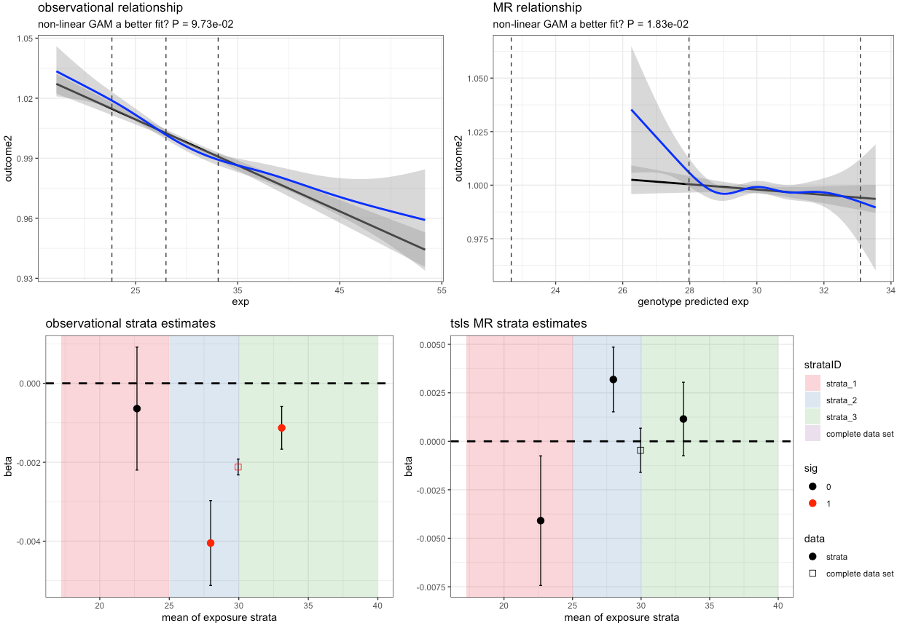

# glsmr

### GAM and linear stratified MR

This is an R package to aid in determining if observational or two-stage least square (instrument variable or in genetics Mendelian randomization) analysis have a non-linear relationship between expoosure and outcome. 

### installation

	devtools::install_github("hughesevoanth/glsmr")

### use
	
- There are two functions that are most useful
	
		> glsmr()
		> plot_glsmr()
	
       ## example using glsmr
       	
		myexample = glsmr( wdata = mydata,
              outcome = "glucose",
              exposure = "bmi",
              instrument = "bmi_grs",
              linear_covariates = c("batch", "sex"),
              smooth_covariates =  c("age"),
              # strata = "quartiles",
              strata = c(17,25,30,62),
              rnt_outcome = TRUE,
              weights_variable = NA,
              sd_outlier_cutoff = 5,
              sd_or_iqr_cutoff = "iqr")
              
       ## example using plot_glsmr()
		
		plot_glsmr(myexample)

### An example figure from plot_glsmr()

